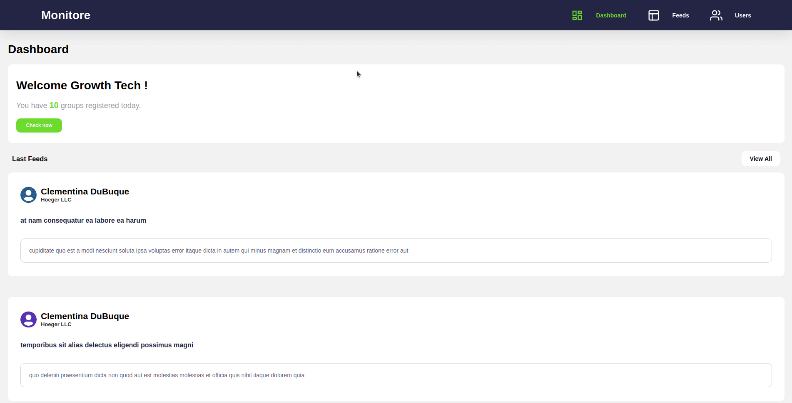

# Monitore :satellite:

:sunglasses: A Chalange of Growth tech company :sunglasses:

## _About the chalange :bulb:_

The idea is basicly consume an api making you own backend and frontend with the simple task <b>show the list of all companies and all post of then</b>

## How to run

### Steps:

- Install all packages using `NPM` or `Yarn` in both repository.
- Start server on backend using <code>yarn start</code> or <code>npm run start</code>
- Start server on frontend using <code>yarn start</code> or <code>npm run start</code>
- Finish !! you may consume the frontend in localhost:3000 :blush:

## Backend :floppy_disk:

### Techs :factory:

- Axios
- Express ( Required )
- cors

## Frontend :computer:

### Techs :factory: 

- React ( Required )
- React-activity
- React-icons
- React-router-dom
- Axios
- Styled-components
